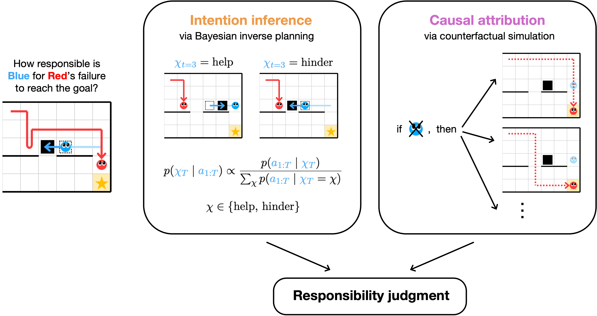

# Helping and hindering as counterfactual difference-making

This repository contains the experiments, data, analyses, and links to preregistrations for the paper
"Helping and hindering as counterfactual difference-making".

__Contents__:
- [Introduction](#introduction)
- [Preregistrations](#preregistrations)
- [Repository structure](#repository-structure)
- [Running the model](#running-the-model)

## Introduction

What does it mean for one person to help or hinder another? We argue that at least two factors are important: the person's intention, and what difference their actions made. While prior work has focused on inferring someone's helping or hindering intentions, we show here that counterfactual simulation is critical for understanding whether they _actually_ helped or hindered. We develop and test a computational model of responsibility for social actions that integrates intention inference (via inverse planning) with causal attribution (via counterfactual simulation). Experiment 1 investigates scenarios where one agent helps or hinders another by acting on the physical environment. Experiment 2 features more complex interactions where one agent can influence another by signaling their intentions, sometimes without any physical intervention. Finally, Experiment 3 investigates how prior interactions can shape responsibility for the agent who was helped or hindered, based on the beliefs they formed about the other agent. Together, our findings demonstrate that we evaluate others not only for what they intended, but also for whether their actions made a counterfactual difference to the outcome.



## Preregistrations

Preregistrations for all experiments are available on the Open Science Framework (OSF):
- Experiment 1: [Responsibility condition](https://osf.io/qac94/overview?view_only=8b45b05597744b1295ec2702df669ffa),
[other conditions](https://osf.io/sebph/overview?view_only=4491dac69ec24888bd3c9be158dd3a9d)
- Experiment 2: [Responsibility condition](https://osf.io/nr293/overview?view_only=a528e62022f74bd391b7fcb6c0d3e275),
[other conditions](https://osf.io/kvxu8/overview?view_only=c10a30c86b60497ca50b800f64a2f849)
- Experiment 3: [All conditions](https://osf.io/qez3s/overview?view_only=69a89d442dd041e2a6b8478687c19eef)


## Repository structure

```
├── model
├── analysis
├── data
│   ├── experiment1
│   └── ...
├── docs
│   ├── experiment1
│   └── ...
└── figures
```

- `model` contains all the code for the computational model (see usage details below).
- `analysis` contains all the code for analyzing data and generating figures, written in R
  (view a rendered file [here](https://anonymous.4open.science/w/helping_hindering/)).
- `data` contains anonymized data from all experiments. For each experiment:
  - `trials.csv` contains the response data.
  - `participants.csv` contains demographic information and post-experiment
    feedback/comments from participants.
- `docs` contains all the experiment code.
- `figures` contains all the figures from the paper (generated using the script in `analysis`).

# Running the model

From the `model` directory, `main.py` is the main script for generating trials and running the model.
It takes in JSON files from the `trial_info` directory, and outputs images to the `trials` directory and prints model predictions.
The command structure is:
```
python main.py --exp [exp_number] --trial [trial_number] [model_flags]
```
where `[exp_number]` specifies either experiment `1`, `2`, or `3`, and
`[trial_number]` is the trial number (1--30 for experiment 1, 1--24 for experiment 2, or 1--12 for experiment 3).
This flag can be left off to run all trials for that experiment.
For experiment 3, additionally add on `--t1` and/or `--t2` to run the first and/or second round of that trial.

Additional flags for running specific models include:
- `--int`: intention model
- `--cf`: counterfactual model
- `--effort`: effort model
- `--int-prior`: intention model on second round with first round posterior as prior (experiment 3 only)
- `--cf-uniform-prior`: counterfactual belief model with a uniform prior for the red agent (experiment 3 only)
- `--cf-updated-prior`: counterfactual belief model with an updated prior for the red agent (experiment 3 only)

Additional parameter arguments:
- `--n-simulations`: number of counterfactual simulations (default `1000`)
- `--prob-follow`: parameter for conditioning counterfactual path on actual path (default `0.1`)
- `--seed`: random seed for reproducibility (default `0`)
- `--epsilon`: parameter for epsilon-greedy action selection (default `0.2`)
- `--cf-softmax-beta`: softmax beta for action selection in counterfactual simulations (default `1`)
  - The best fitting values were `2.3` for experiment 1 and `1.2` for experiments 2 and 3
- `--int-softmax-beta`: softmax beta for intention inference (default `1`)
  - The best fitting values were `1.8` for experiment 1, `1.2` for experiment 2, and `1.0` for experiment 3
- `--softmax-beta-belief`: softmax beta for sophisticated agent belief updating (experiments 2 and 3 only, default `0.5`)
  - The best fitting values were `0.5` for experiment 2 and `0.01` for experiment 3
